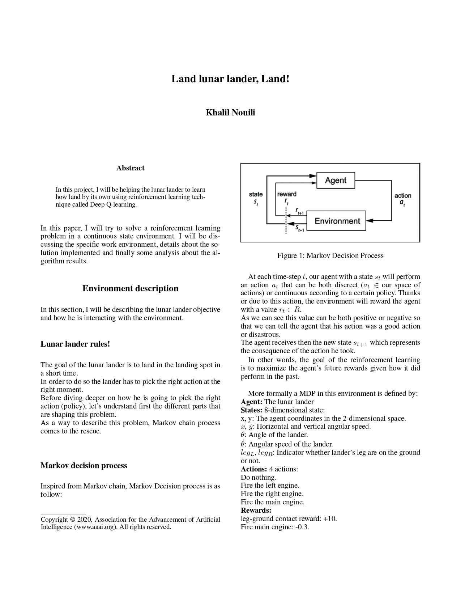
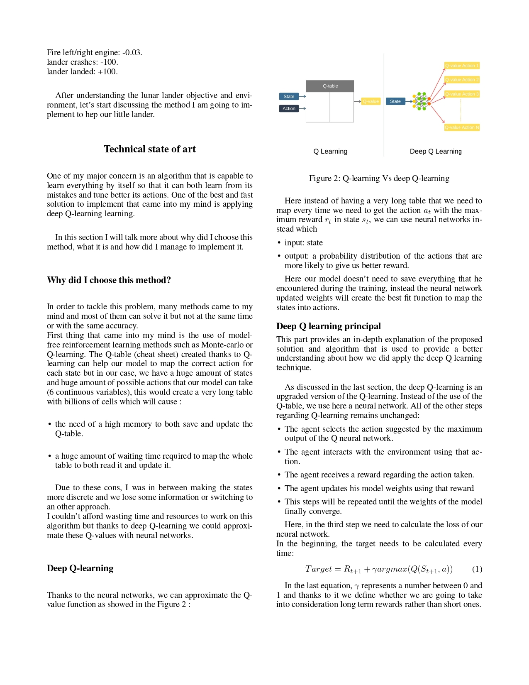
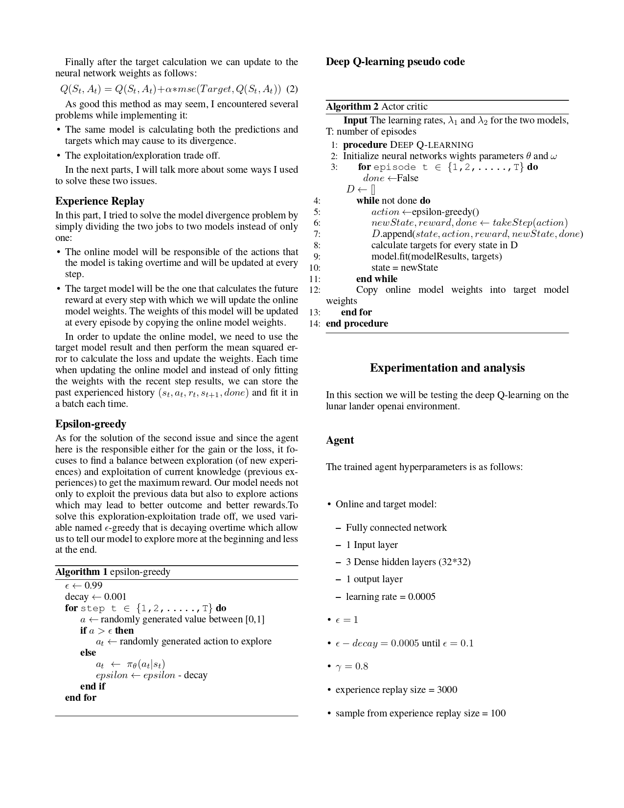
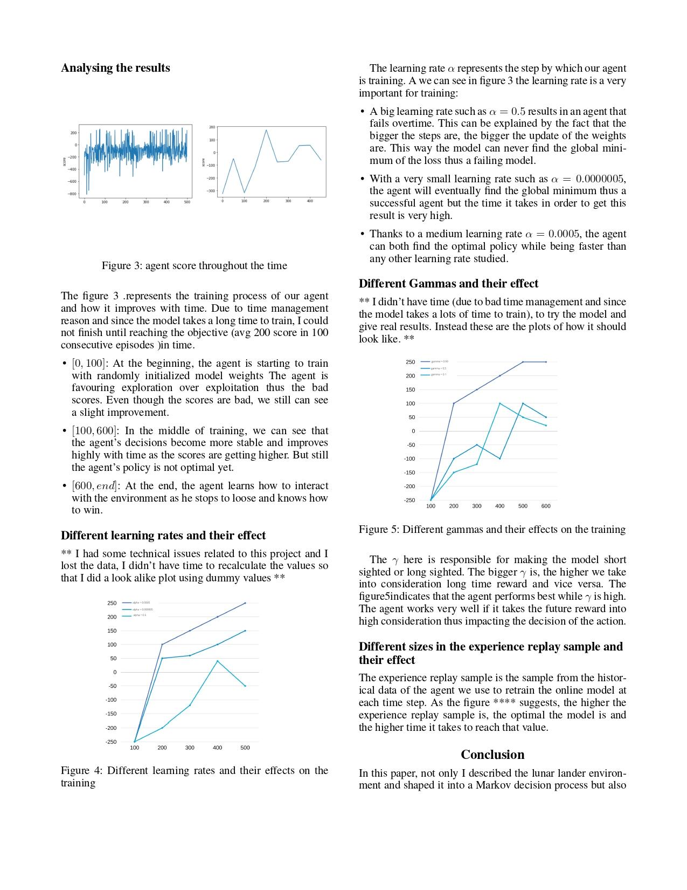
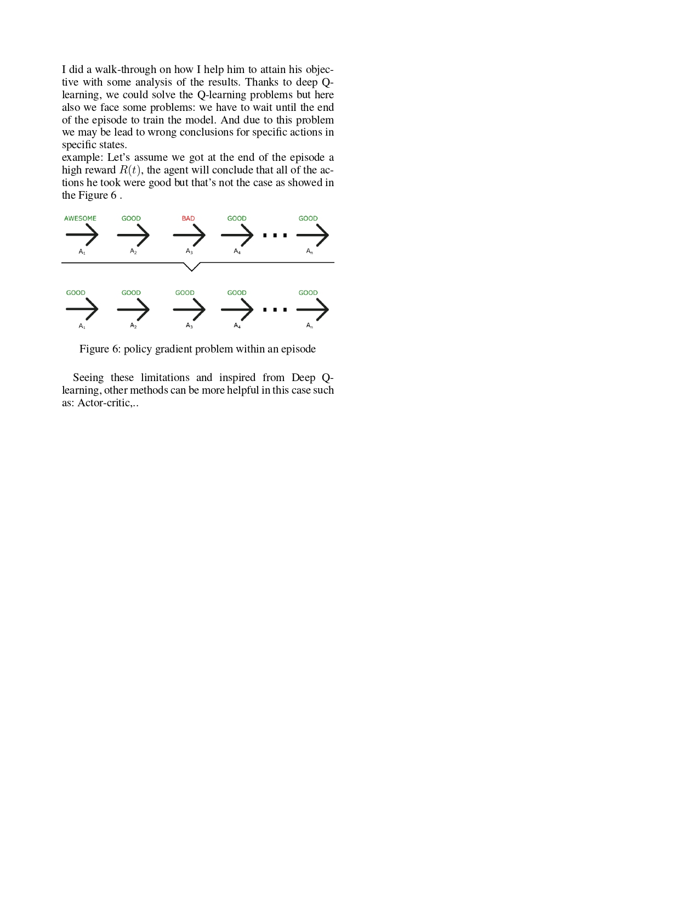

# Luner lander using DQN

This project aims to solve the lunar lander problem using reinforcement learning technique called DQN.

## Getting Started

These instructions will get you a copy of the project up and running on your local machine.
### Prerequisites

In order to get this prpject running on our machine, you need to have

```
Python v3.6
Jupyter-notebook
```

### Installing

After setting up the environmnet, you need to install the used python libraries in this project

```
 pip3 install -r requirements.txt
```

## Run the project
This project is divided into 3 parts.

In order to train the agent run:
```
 python3 train.py
```

In order to test the agent's performance run:
```
 python3 test.py
```

In order to see how I plotted run:
```
using Jupyter-notebook, open Analysis.ipynb file.
```


## More about the project 





